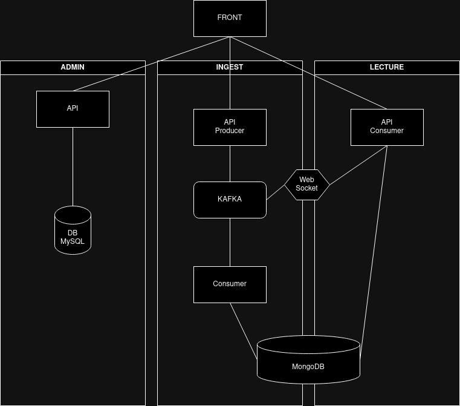

Projet Discord Scala

Prérequis:
Docker installé sur votre machine.

Pour lancer l'applis :

docker-compose up --build

Arrêter et Supprimer l'Application :
docker-compose down -v

Equipe : 
- Olivier CARRERE-GEE
- Mounic CLEMENT
- Jérémi LIOGER--BUN
- OMAR BENZEROUAL

